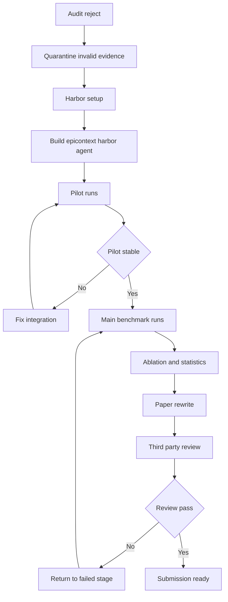

# EpiContext Harbor 重跑总计划 v1

## 1. 重启决策

本次不是在旧稿上做局部修补，而是按审计结论进行**证据链重建**。凡是无法由真实代码、真实 Harbor 运行、真实日志和真实任务结果支撑的内容，一律视为失效资产，不得继续进入论文主叙事。

核心路线已经锁定为：

- 保留 Agent 研究方向
- 放弃旧的玩具模拟环境主实验
- 以 Harbor 作为统一评测与运行编排框架
- 在 Harbor 支持的真实 benchmark 上重跑主实验、基线、消融与重复试验
- 仅在证据充分后重写论文

---

## 2. 审计结论驱动的硬约束

### 2.1 必须立即作废的旧证据

以下资产只能作为失败案例留档，不能继续作为论文证据：

- `code/experiments/run_main.py` 及其产物
- `code/epicontext/benchmarks/environments.py` 中的模拟 benchmark 实现
- `code/results/results_summary.txt`
- 旧稿中关于 four agent benchmarks、70.3% token reduction、competitive task success 等所有未被真实运行支撑的表述
- `code/experiments/run_real_llm.py` 中硬编码密钥及其派生实验结论

### 2.2 暂时保留但降级处理的资产

以下内容可以保留为候选技术资产，但必须重新验证后才能进入论文：

- `code/epicontext/core.py` 中的上下文图谱、算子、适应度函数思想
- `code/epicontext/agent.py` 中的高层接口设计
- `code/experiments/large_scale_v5.py` 的优化代理实验

这些内容最多只能作为：

- 设计动机
- 早期代理实验
- 附录或补充实验候选

不能再充当主实验主证据。

---

## 3. Harbor 调研结论

基于公开仓库检索，当前可确认的事实如下：

1. Harbor 是专门用于运行 agent evaluation 与 RL environment 的框架，带有 CLI、agent 抽象、environment 抽象、trial orchestration、metrics、viewer 和 jobs/trials 产物目录。
2. Harbor 内置或支持多类 agent，包括 claude-code、codex、openhands、aider、gemini-cli、cursor-cli、swe-agent 等。
3. Harbor 支持 benchmark adapter 机制，公开检索结果中可以确认它支持多种第三方 benchmark，至少包括 swebench、swebenchpro、multi-swe-bench、gaia、financeagent、medagentbench、bird_bench 等。
4. Harbor 是 Terminal-Bench 2.0 的官方运行框架，Terminal-Bench 2.0 提供真实容器化任务。
5. Harbor 的标准产物包含 jobs、trials、result.json、trajectory、verifier reward 等留痕，这非常适合作为论文的可审计证据链。
6. Terminal-Bench-Science 当前公开任务数非常少，不适合单独作为论文主 benchmark，但可作为补充方向或未来工作候选。

因此，本次论文的真实实验路线应优先选择：

- Harbor 原生支持且已广泛使用的 benchmark
- 有标准 verifier 的 benchmark
- 能稳定产出 token、trajectory、reward、failure trace 的 benchmark
- 可以用相同 Harbor harness 公平运行多 agent / 多 model / 多配置的 benchmark

---

## 4. 推荐 benchmark 组合

### 4.1 主 benchmark 组合

#### A. Terminal-Bench 2.0

用途：

- 作为真实长程终端任务 benchmark
- 检验 EpiContext 在多步工具使用、文件编辑、命令执行、故障恢复中的上下文管理价值

原因：

- Harbor 官方支持
- 任务真实、容器化、可复现
- 适合观察长轨迹与上下文膨胀

#### B. SWE-Bench 或 SWE-Bench Pro

用途：

- 作为软件工程 bug-fixing benchmark
- 检验 EpiContext 在跨文件修复、测试反馈、多轮尝试中的上下文裁剪能力

原因：

- Harbor adapter 已支持
- 社区认可度高
- 与 agent coding 论文叙事高度契合

### 4.2 候选补充 benchmark

#### C. BeyondSWE Harbor 版本

用途：

- 检验更复杂工程任务中的上下文路由收益
- 增强论文对不同任务类型的覆盖

条件：

- 仅在 Harbor 接入与数据获取成本可控时启用
- 若会显著拖慢主实验，不作为第一阶段阻塞项

### 4.3 不建议继续坚持的旧 benchmark 组合

以下 benchmark 若没有 Harbor 原生路径或稳定接入路径，不应为了复刻旧稿而强行保留：

- WebArena
- ALFWorld
- 旧版 AgentBench 模拟流程

如果后续执行中发现 Harbor 对这些基准缺乏稳定支持，则论文 benchmark 套件将重构为 Harbor-native suite，而不是继续复刻旧的四基准叙事。

---

## 5. 论文重新定位

新论文定位建议：

**EpiContext 是一种适用于真实长轨迹 agent 的上下文调控层，可作为 Harbor-compatible agent middleware / agent variant，在真实 benchmark 上降低上下文冗余并改善任务效率。**

这一定义有几个好处：

1. 仍然保留 Agent 方向
2. 不再依赖虚假的玩具 benchmark 结果
3. 能与 Harbor 的 agent 抽象自然对接
4. 便于做同 agent 不同上下文策略的公平对比

新的核心 claim 必须收缩为两类，不能超额承诺：

- **效率 claim**：token、context length、cost、trajectory length、wall-clock efficiency
- **效果 claim**：task success、pass rate、verified reward、patch resolution

只有当统计证据明确支持时，才能声称提升成功率；否则只能声称在不损害效果的前提下提高效率。

---

## 6. 代码重构计划

### Phase 0: 证据隔离与合规修复

1. 新建 `ROADMAP.md`，记录本轮重跑的所有决策、失败、修复与证据路径。
2. 在 `PROGRESS.md` 中显式标记旧模拟实验已失效。
3. 删除或替换所有硬编码密钥，统一改为环境变量。
4. 将旧实验产物移入废弃证据区或在文档中显式标记 invalid。

### Phase 1: Harbor 接入与最小可运行栈

1. 将 Harbor 仓库克隆到工作区可控子目录。
2. 按官方安装文档完成 Harbor 安装。
3. 跑通 Harbor CLI 的最小自检：
   - agent 列表
   - benchmark / adapter 列表
   - oracle 任务
   - 单任务真实运行
4. 确认用户现有 OpenAI-compatible endpoint 是否能被 Harbor 正常消费。

### Phase 2: EpiContext 工程化改造

1. 把 `code/epicontext/core.py` 抽象成可插入 Harbor agent 的上下文选择层。
2. 移除模板 thought / action 占位逻辑。
3. 不再自己伪造 environment，而是接入 Harbor 的真实 task runtime。
4. 用真实 tokenizer 或 Harbor 原生 token 统计替换粗糙估算。
5. 补齐单元测试与最小集成测试。

### Phase 3: Harbor Agent 方案设计

两个实现候选：

#### 方案 A. Wrapper Agent

- 选定一个 Harbor 已支持的强 agent 作为底座
- EpiContext 作为其上下文装配与历史裁剪层
- 优点是公平对比直接，落地快
- 缺点是需要理解 Harbor agent 生命周期

#### 方案 B. Middleware Agent Variant

- 新增 `epicontext-<base-agent>` 变体
- 显式暴露甲基化、乙酰化、重组、预算控制等参数
- 优点是论文实验更干净
- 缺点是实现工作量更大

建议优先走方案 A，若 Harbor agent 接口允许再抽象为方案 B。

---

## 7. 实验重跑计划

### 7.1 实验设计原则

1. 所有主实验必须由 Harbor 真实运行得到。
2. 所有对比必须使用同一 benchmark、同一任务集、同一 budget、同一 base agent。
3. 必须保存原始 logs、trajectory、result.json、reward 和失败 trace。
4. 先做 pilot，小规模通过后再扩到主实验。
5. 不允许边写论文边补结果；必须先锁证据，再写结论。

### 7.2 实验矩阵

#### 主对比

在相同 base agent 上比较：

- Full-context baseline
- Sliding-window baseline
- Retrieval / summary baseline 若 Harbor 或底座 agent 易于接入
- EpiContext default
- EpiContext without methylation
- EpiContext without acetylation
- EpiContext without crossover 或 fallback policy

#### 跨框架对比

若算力和成本允许：

- 至少两个 Harbor agent framework
- 每个 framework 上各自比较原始版本与 EpiContext 版本

这会回答两个问题：

1. EpiContext 是否只对某一个 agent framework 有效
2. EpiContext 的收益是否跨 framework 保持稳定

#### 跨模型对比

若 Harbor 能稳定接入用户现有 endpoint，则至少设计：

- 统一 base model 的主实验
- 一个额外模型的泛化验证

如果第二模型无法稳定接入，则主论文只保留单模型强证据，泛化实验放补充材料。

### 7.3 benchmark 分层执行

#### Stage P1: Pilot

- 每个 benchmark 先抽少量任务
- 检查 Harbor 跑通、日志完整、token 统计可信、任务难度合理
- 验证 EpiContext 不会破坏 agent 主循环

#### Stage P2: Main Run

- Terminal-Bench 2.0 主实验
- SWE-Bench 主实验
- 每个实验做充分重复与随机种子控制

#### Stage P3: Ablation + Sensitivity

- 去掉各个算子
- 调不同 context budget
- 调不同 activation threshold
- 分析成功案例与失败案例

### 7.4 统计与结果要求

必须至少产出：

- pass rate / reward
- token input / output / total
- context length statistics
- average turns / steps
- wall-clock runtime
- cost estimate
- paired significance test
- effect size
- per-task win rate

统计口径必须从 Harbor 原始产物脚本化生成，不能手工拼表。

---

## 8. 结果留痕与可审计性计划

所有结果必须形成完整证据链：

1. 任务配置快照
2. Harbor 运行命令
3. git commit hash
4. agent 参数
5. model 参数
6. benchmark 版本
7. 原始 jobs / trials 目录
8. 自动汇总脚本
9. 最终表格生成脚本
10. 论文中的每一个数字到原始 JSON 的映射表

建议目录结构：

- `artifacts/harbor_runs/`
- `artifacts/analysis/`
- `artifacts/tables/`
- `artifacts/figures/`
- `artifacts/audit_trail/`

必须新增一份数据一致性核对文档，逐条比对论文中的数字与 Harbor 结果。

---

## 9. 论文重写计划

### 9.1 必须重写的章节

- abstract
- introduction
- experiments
- discussion
- appendix 中与旧模拟 benchmark 绑定的部分

### 9.2 可部分复用的章节

- related work
n- methodology

但即使复用，也要做两件事：

1. 把所有超出真实实现的表述删掉
2. 把方法定义改成与 Harbor 中实际实现一致

### 9.3 新论文叙事骨架

#### Problem

真实长轨迹 agent 在 benchmark 中出现上下文膨胀，导致 token 成本高、历史噪声累积、决策效率下降。

#### Insight

并非所有历史上下文都应等权保留；上下文需要被动态表达，而不是被静态堆叠。

#### Design

EpiContext 通过甲基化、乙酰化、重组与预算控制，对 agent 运行时上下文做动态调控。

#### Evidence

在 Harbor 统一 harness 下，EpiContext 相对强基线在真实 terminal / SWE 类 benchmark 上带来可复现的效率收益，并在若干设置下维持或提升任务成功率。

### 9.4 写作红线

1. 不再写任何未运行 benchmark 名称。
2. 不再写任何无法从结果表直接回溯的数字。
3. 若统计不显著，不得包装成显著优势。
4. 若只证明效率收益，就只声称效率收益。
5. 若跨 benchmark 结论不稳定，必须诚实呈现异质性。

---

## 10. 第三方复审与闭环

在论文重写完成后，必须进行两轮外部化审查：

### Review A: 代码与实验审查

检查：

- Harbor 接入是否真实
- benchmark 是否真实
- token 与 reward 是否来源可信
- 结果脚本是否可复现

### Review B: 论文与学术诚信审查

检查：

- claim 与 evidence 是否一一对应
- 统计表述是否严格
- related work 是否准确
- 局限性是否诚实

任一审查失败，都必须返回对应阶段重跑。

---

## 11. 执行顺序

---

## 12. 进入 code 模式前的明确执行清单

1. 创建 `ROADMAP.md` 与新的审计留痕结构
2. 清理硬编码密钥与失效声明
3. 克隆并安装 Harbor
4. 验证 Harbor 最小运行路径
5. 选择主 benchmark 任务子集做 pilot
6. 设计并实现 Harbor-compatible EpiContext agent
7. 跑通 baseline 与 EpiContext 的单任务对照
8. 扩展为小规模 pilot 批次
9. 审核 pilot 证据链
10. 通过后再开主实验

---

## 13. 当前建议

建议立刻切换到执行模式，但执行时必须遵守以下策略：

- 先打通 Harbor 与最小真实 benchmark
- 再做 EpiContext 接入
- 再扩大实验规模
- 最后才写论文

如果中途发现 Harbor 无法稳定接入当前模型 endpoint，则优先更换 Harbor 已稳定支持的 agent / model 组合，而不是回退到旧模拟实验。
